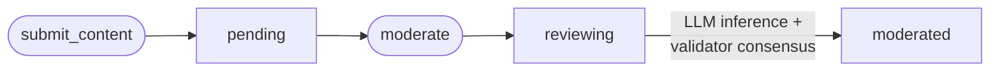

# content-moderator-contract


AI-powered content moderation smart contract built on [GenLayer](https://genlayer.com) — a blockchain that lets smart contracts run LLM inference natively. This contract submits user content for review, classifies it via an AI prompt, and stores the verdict, severity score, and reasoning on-chain with full validator consensus.

---

## Overview

| Feature | Detail |
|---|---|
| Platform | GenLayer blockchain |
| Language | Python (GenLayer SDK) |
| Version | v0.2.16 |
| Verdicts | `APPROVED` · `REJECTED` · `REVIEW` |
| Severity scale | 0 (safe) → 10 (extremely harmful) |

---

## Content lifecycle



> **Note:** `total_submitted` and `total_moderated` will differ whenever items have been submitted but not yet moderated. An item moves from `pending` → `reviewing` → `moderated` only after `moderate()` is explicitly called.

---

## Contract state

| Variable | Type | Description |
|---|---|---|
| `next_id` | `u256` | Auto-incrementing content ID counter (starts at 1) |
| `total_moderated` | `u256` | Count of fully moderated items only |
| `contents` | `TreeMap[u256, str]` | Raw submitted content |
| `submitters` | `TreeMap[u256, str]` | Submitter wallet addresses |
| `categories` | `TreeMap[u256, str]` | Content category labels |
| `statuses` | `TreeMap[u256, str]` | Lifecycle status per item |
| `verdicts` | `TreeMap[u256, str]` | AI verdict per item |
| `reasonings` | `TreeMap[u256, str]` | AI reasoning explanation |
| `severity_scores` | `TreeMap[u256, str]` | Numeric severity 0–10 |

---

## Methods

### `submit_content(content: str, category: str) → int`

Submits content for moderation. Returns the assigned `content_id`.

```python
contract.submit_content("This is a test post.", "forum_post")
# returns: 1
```

**Parameters:**

| Parameter | Type | Description |
|---|---|---|
| `content` | `str` | The text to moderate. Must be ≥ 5 characters |
| `category` | `str` | Label for the content type (e.g. `"social_media"`, `"comment"`, `"forum_post"`, `"review"`, `"message"`) |

**Reverts if:**
- `content` is fewer than 5 characters → `"Content must be at least 5 characters"`

---

### `moderate(content_id: u256) → dict`

Triggers AI moderation for a pending item. Uses `gl.nondet.exec_prompt` to call an LLM and `gl.eq_principle.strict_eq` to reach consensus across validators.

```python
contract.moderate(1)
# returns:
# {
#   "verdict": "APPROVED",
#   "severity_score": 0,
#   "violations": [],
#   "reasoning": "The content is respectful and follows community guidelines."
# }
```

**Reverts if:**
- The item's status is not `"pending"` → `"Content is not pending"`
- This prevents double-moderation of the same content ID

**Violation categories checked by the LLM:**
- Hate speech or discrimination
- Violence or threats
- Sexual or explicit content
- Harassment or bullying
- Spam or scam content
- Misinformation
- Illegal activity promotion

---

### `get_content(content_id: u256) → dict`

Read-only. Returns the full on-chain record for a given content ID.

```python
contract.get_content(1)
# returns:
# {
#   "id": 1,
#   "content": "This is a test post.",
#   "category": "forum_post",
#   "submitter": "0xabc...",
#   "status": "moderated",
#   "verdict": "APPROVED",
#   "severity_score": "0",
#   "reasoning": "Content is safe and respectful."
# }
```

---

### `get_stats() → dict`

Read-only. Returns aggregate contract statistics.

```python
contract.get_stats()
# returns:
# {
#   "total_submitted": 5,
#   "total_moderated": 3
# }
```

> `total_submitted` counts all items ever submitted. `total_moderated` counts only items where `moderate()` has completed. The difference represents items still in `pending` or `reviewing` state.

---

## Verdict reference

| Verdict | Severity range | Meaning |
|---|---|---|
| `APPROVED` | 0–3 | Content is safe and follows community guidelines |
| `REVIEW` | 3–6 | Borderline or ambiguous — flagged for human review |
| `REJECTED` | 6–10 | Contains hate speech, violence, explicit material, harassment, spam, or illegal content |

---

## Getting started

### Prerequisites

- A [GenLayer Studio](https://studio.genlayer.com) account or local GenLayer node
- Python 3.10+
- The GenLayer SDK dependency declared at the top of the contract:
  ```
  # { "Depends": "py-genlayer:1jb45aa8ynh2a9c9xn3b7qqh8sm5q93hwfp7jqmwsfhh8jpz09h6" }
  ```
  GenLayer Studio resolves this automatically on deploy — no manual install needed.

### Deploy

1. Clone this repo:
   ```bash
   git clone https://github.com/Goddesszee/content-moderator-contract.git
   cd content-moderator-contract
   ```

2. Open [GenLayer Studio](https://studio.genlayer.com), create a new contract, and paste in `content_moderator.py`.

3. Deploy to the testnet. Copy the contract address for use in your frontend or scripts.

---

## Example interaction

```python
# 1. Submit spam content
id = contract.submit_content("Buy cheap watches now!! Click here.", "comment")

# 2. Run moderation
result = contract.moderate(id)
print(result["verdict"])        # "REJECTED"
print(result["severity_score"]) # 7
print(result["violations"])     # ["Spam or scam content"]

# 3. Retrieve the full record
record = contract.get_content(id)
print(record["status"])         # "moderated"
print(record["reasoning"])      # "This content is promotional spam..."

# 4. Check global stats
stats = contract.get_stats()
print(stats["total_submitted"])  # 1
print(stats["total_moderated"])  # 1
```

---

## Contributing

Contributions are welcome! To get started:

1. Fork the repository
2. Create a feature branch: `git checkout -b feat/your-feature`
3. Commit your changes: `git commit -m "feat: describe your change"`
4. Push and open a pull request

Please open an [issue](https://github.com/Goddesszee/content-moderator-contract/issues) first for significant changes so we can discuss the approach.

---

## License

MIT — see [LICENSE](LICENSE) for details.
